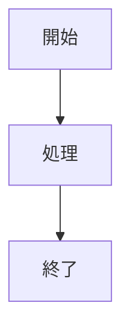

# light-md 操作マニュアル

> 最終更新: 2026-03-20

---

## 目次

1. [画面構成](#画面構成)
2. [ファイル操作](#ファイル操作)
3. [タブ管理](#タブ管理)
4. [エクスプローラー](#エクスプローラー)
5. [ドラッグ＆ドロップ](#ドラッグドロップ)
6. [編集機能](#編集機能)
7. [フォーマットツールバー](#フォーマットツールバー)
8. [テーブル挿入](#テーブル挿入)
9. [画像の貼り付け](#画像の貼り付け)
10. [プレビュー](#プレビュー)
11. [PDF印刷](#pdf-印刷)
12. [設定](#設定)
13. [キーボードショートカット一覧](#キーボードショートカット一覧)

---

## 画面構成

```text
┌──────────────────────────────────────────────────────────────────┐
│ [☰][開く]         [Split/TOC] [編集][プレビュー] [☀/🌙][⚙]      │ ヘッダー
├──────────────────────────────────────────────────────────────────┤
│ [+][tab1 ●×][tab2 ×]                                            │ タブバー
├──────────┬──────────────────────────┬─┬──────────────────────────┤
│          │ [B][I][H1]...            │ │                          │ ツールバー
│ Explorer ├──────────────────────────┤ ├──────────────────────────┤
│ サイドバー│  エディタ                │▌│ プレビュー / TOC         │
│ (☰トグル) │                          │ │                          │
└──────────┴──────────────────────────┴─┴──────────────────────────┘
```

| 要素 | 説明 |
| ------ | ------ |
| `☰` | エクスプローラーサイドバーの表示/非表示 |
| `開く` | ファイルを開くダイアログ |
| `Split` | 編集モードでエディタ右にプレビューを並べて表示 |
| `TOC` | プレビューモードで右に目次サイドバーを表示 |
| `編集 / プレビュー` | モード切替 |
| `☀/🌙` | ライト/ダークテーマ切替 |
| `⚙` | 設定モーダルを開く |

---

## ファイル操作

### 開く

- ヘッダーの **「開く」** ボタン → ファイル選択ダイアログ（`.md` / `.txt`）
- エクスプローラーサイドバーのファイルをクリック
- ファイルをウィンドウへドラッグ＆ドロップ
- アプリアイコンへファイルをドロップして起動

すでに開いているファイルを再度開くと、既存のタブに切り替わります（重複タブは作られません）。

### 保存

- `Ctrl+S` — 上書き保存（未保存ファイルは「名前を付けて保存」ダイアログ）
- タブ名の `●` は未保存の変更があることを示します

### 対応ファイル形式

エクスプローラーから開けるテキスト系ファイル:
`md / txt / json / yaml / yml / toml / csv / ts / tsx / js / jsx / html / css / xml / log / ini / conf / sh / bat`

それ以外のファイル（画像・バイナリ等）は「表示できません」と表示されます。

---

## タブ管理

| 操作 | 方法 |
| ------ | ------ |
| 新規タブ | タブバーの `[+]` ボタン |
| タブ切替 | タブをクリック / `Ctrl+Tab`（次へ） / `Ctrl+Shift+Tab`（前へ） |
| タブを閉じる | タブの `×` ボタン（未保存時は確認ダイアログ） |
| 他のタブを閉じる | タブを右クリック →「他のタブをすべて閉じる」 |
| すべてのタブを閉じる | タブを右クリック →「すべてのタブを閉じる」 |

起動時は前回開いていたタブが自動復元されます。ファイルが移動・削除されていた場合はそのタブはスキップされます。

---

## エクスプローラー

- ヘッダーの `☰` で表示/非表示を切替
- **フォルダを選択** ボタンでルートフォルダを指定
- フォルダ名をクリックで展開/折り畳み
- ファイル名をクリックで新タブ（または空タブ）に開く
- サイドバー右端のハンドルをドラッグして幅を調整できます（160px〜480px、再起動後も保持）

---

## ドラッグ＆ドロップ

| ドロップ対象 | 動作 |
| --- | --- |
| **ファイル** をウィンドウにドロップ | タブで開く |
| **フォルダ** をウィンドウにドロップ | エクスプローラーにそのフォルダを表示（サイドバーが自動で開く） |
| **アプリアイコン** にファイルをドロップして起動 | 起動後にそのファイルをタブで開く |

ドラッグ中はウィンドウ全体に青い点線のオーバーレイが表示されます。

---

## 編集機能

### Tab / Shift+Tab

- `Tab` — カーソル位置にスペースを挿入（デフォルト2個、設定で4個に変更可）
- `Shift+Tab` — 行頭のスペースを削除（tabWidth 分）

### 括弧・記号の自動補完

以下のキーを押すと、対応する閉じ記号が自動挿入されカーソルが内側に移動します。

| 入力 | 補完結果 |
| ------ | ---------- |
| `(` | `()` |
| `[` | `[]` |
| `` ` `` | ` `` ` ` |

### Undo / Redo

- `Ctrl+Z` — 元に戻す
- `Ctrl+Y` — やり直す

タブごとに独立した履歴（最大200エントリ）。タイピングは500ms デバウンスでまとめて記録、ツールバー操作は即時記録されます。

---

## フォーマットツールバー

編集モード時のみ表示されます。

| ボタン | ショートカット | 動作 |
| -------- | ---------------- | ------ |
| **B** | `Ctrl+B` | 選択テキストを `**太字**` にする |
| *I* | `Ctrl+I` | 選択テキストを `*斜体*` にする |
| H1 | — | 行頭に `#` を付与/削除 |
| H2 | — | 行頭に `##` を付与/削除 |
| H3 | — | 行頭に `###` を付与/削除 |
| `—` | — | 行頭に `-` を付与/削除（箇条書き） |
| `1.` | — | 行頭に `1.` を付与/削除（番号リスト） |
| `` ` `` | — | 選択時: インラインコード / 未選択時: コードブロック挿入 |
| `⊞` | — | テーブル挿入（詳細は次節） |

Bold/Italic はすでにマークアップされている箇所を再クリックしても除去はされません。

---

## テーブル挿入

### ケース1: 未選択で `⊞` をクリック

カーソル位置に2列2行のテンプレートが挿入され、「列1」が選択状態になります。

```markdown
| 列1 | 列2 |
| --- | --- |
| セル | セル |
```

そのまま入力するとヘッダー名を上書きできます。`Tab` でセル間を移動しながら編集してください。

### ケース2: テキストを選択して `⊞` をクリック

選択範囲をカンマ区切りとして解析し、Markdown テーブルに変換します。複数行の場合は1行目がヘッダーになります。

**例:** 以下を選択して `⊞`

```text
名前,年齢,職業
田中,25,エンジニア
```

↓

```markdown
| 名前 | 年齢 | 職業 |
| --- | --- | --- |
| 田中 | 25 | エンジニア |
```

### ケース3: Excel/スプレッドシートから貼り付け（`Ctrl+Shift+V`）

Excel やスプレッドシートでセル範囲をコピーし、エディタで `Ctrl+Shift+V` を押します。タブ区切り・改行区切りのデータを自動検出して Markdown テーブルに変換します。1行目がヘッダー行になります。

> **注意:** `Ctrl+Shift+V` はタブ区切りテキストのみ対応します。通常のテキストには反応しません（通常の `Ctrl+V` で貼り付けてください）。

---

## 画像の貼り付け

> **前提条件:** ファイルが保存済みであること（未保存の新規タブでは動作しません）

スクリーンショットや画像ファイルをクリップボードにコピーした状態でエディタに `Ctrl+V` を押すと、以下の処理が自動で行われます。

1. 開いているファイルと同じフォルダ内に `image/` フォルダを作成
2. `paste-[タイムスタンプ].[拡張子]` というファイル名で画像を保存
3. カーソル位置に `` を挿入

**例:** `C:\notes\memo.md` を編集中に画像を貼り付けた場合

- 保存先: `C:\notes\image\paste-1710000000000.png`
- 挿入テキスト: ``

プレビューでは相対パス画像が自動的に読み込まれて表示されます。

> **注意:** テキストとして貼り付けたい場合（通常の Ctrl+V）はクリップボードに画像が含まれないよう注意してください。画像が含まれている場合は常に画像貼り付けが優先されます。

---

## プレビュー

### 表示モード

| モード | 説明 |
| -------- | ------ |
| **編集モード**（デフォルト） | エディタのみ表示 |
| **スプリットプレビュー** | `Split` ボタンで有効化。エディタ右にプレビューを並べて表示。スクロール位置が連動します。 |
| **プレビューモード** | ヘッダーの「プレビュー」ボタン。プレビューのみ全画面表示。 |
| **TOCサイドバー** | プレビューモード中に `TOC` ボタンで有効化。右側に目次を表示。 |

スプリット・TOCの区切り線はドラッグしてリサイズできます（幅は再起動後も保持）。

### 対応するMarkdown記法

- **GFM（GitHub Flavored Markdown）**: テーブル、チェックボックス、打ち消し線など
- **シンタックスハイライト**: コードブロックの言語名（例: ` ```js `）を指定するとカラーリング
- **Mermaidダイアグラム**: ` ```mermaid ` ブロックでフローチャートや図を描画

````markdown

````

- **相対パス画像**: Markdown ファイルと同じフォルダ基準の相対パス画像を表示
- **外部リンク**: クリックするとシステムのデフォルトブラウザで開く

### プレビューテーマ

⚙設定から3種類のテーマを選択できます。

| テーマ | 雰囲気 |
| -------- | -------- |
| GitHub | GitHub のドキュメントスタイル（デフォルト） |
| Minimal | シンプルな無彩色スタイル |
| Academic | 暖色系の学術文書スタイル |

---

## PDF 印刷

1. ヘッダーの「プレビュー」でプレビューモードに切替
2. **「PDF」** ボタンをクリックして印刷ダイアログを開く
3. 「PDFとして保存」などを選択

### ページ番号

ページ下部中央に自動でページ番号が表示されます。

### 改ページ指定

Markdown 内に `---`（水平線）を挿入すると、その位置で改ページされます。

```markdown
# 第1章

内容...

---

# 第2章

内容...
```

---

## 設定

ヘッダーの `⚙` ボタンで設定モーダルを開きます。設定は自動で保存され、再起動後も保持されます。

| 設定項目 | 説明 |
| ---------- | ------ |
| エディタフォントサイズ | 12〜20px（スライダーで調整） |
| フォントファミリー | エディタのフォントを選択 |
| タブ幅 | Tab キー挿入スペース数（2 または 4） |
| プレビューテーマ | GitHub / Minimal / Academic |

---

## キーボードショートカット一覧

### ファイル・グローバル

| ショートカット | 動作 |
| ---------------- | ------ |
| `Ctrl+S` | 保存 / 名前を付けて保存 |
| `Ctrl+Z` | 元に戻す |
| `Ctrl+Y` | やり直す |
| `Ctrl+Tab` | 次のタブへ切替 |
| `Ctrl+Shift+Tab` | 前のタブへ切替 |

### エディタ内

| ショートカット | 動作 |
| ---------------- | ------ |
| `Ctrl+B` | 太字（**選択テキスト**） |
| `Ctrl+I` | 斜体（*選択テキスト*） |
| `Tab` | スペース挿入（tabWidth 分） |
| `Shift+Tab` | 行頭スペース削除（tabWidth 分） |
| `Ctrl+V` | 貼り付け（クリップボードに画像があれば画像として挿入） |
| `Ctrl+Shift+V` | タブ区切りテキスト（Excel コピー）を Markdown テーブルとして貼り付け |
| `(` | `()` を挿入してカーソルを内側に移動 |
| `[` | `[]` を挿入してカーソルを内側に移動 |
| `` ` `` | ` `` ` ` を挿入してカーソルを内側に移動 |
